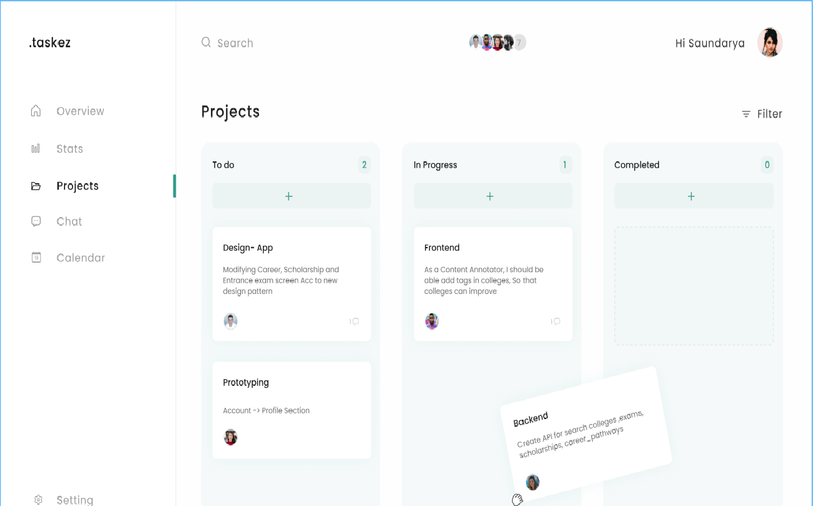

## Taskez is simple task  management platform

###fetaures:-
    1) Kanban board to create and manage tasks.

## Project Status
WIP: Working in progress. 
### Demo link: 
[live demo link: ]("").

This project is currently in development. 
## Installation and Setup Instructions
#### Get Started:  

Clone down this repository. You will need `node` and `npm` installed globally on your machine.  

Installation:

`npm install`  

To Start Server:

`npm start`  

To Visit App:

`localhost:3000/`  